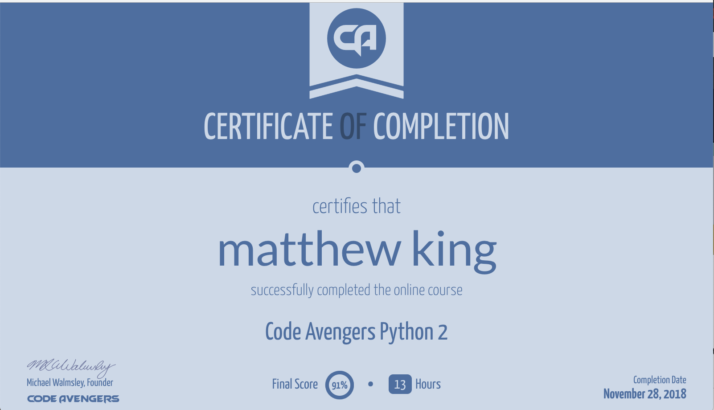
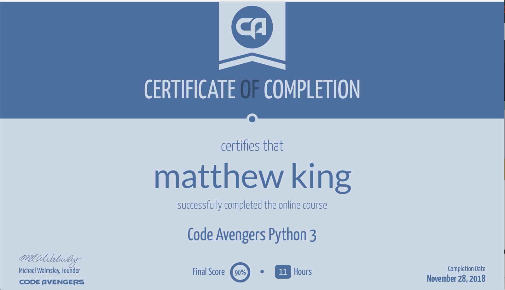
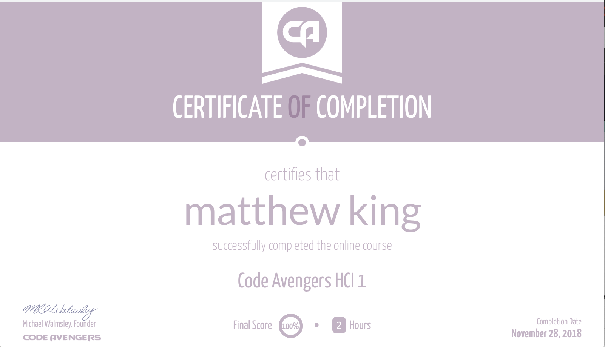

### [Home](../index.md)

# CodeAvengers

Here are links to all my certificates of completion for the website Code Avengers. This website is what we use in DIT to learn various coding languages, they are designed to work with the NCEA curriculum.

### [Home](../index.md)

[NCEA Level 1 Python](https://www.codeavengers.com/certificate.html?U2FsdGVkX18xDyQhihl%2FOCeTvks6JpUnebH7TzD4AlVC1EZdPTfUbcIcPzCj7eXRCePfGQ61LMxZuqEk0PKzySgOyYhq%2Fv2x7BX6uaIAwb710wpL2MgDgl63rwwVzAYLA8nNsctx21S0B49ejKDk%2FFpyOv5e9KvyYZBX8Pc4DlQ%3D)

[NCEA level 2 Python](https://www.codeavengers.com/certificate.html?U2FsdGVkX1%2F7YHr4nompqcWCD5yBL1IdLFgMs4mGYbO1zG95Rgj6YVsMZrJXRc8DoeXSJW4QeJF7Sk8wPUKViQryxXC%2FyI7CNdvZ1kyckfE0abaeGeFwGEjwKvRmbpxCxswun%2B4j7B3h8CuO7w9Gp%2BAqWmrF8WBAlkMEv3ntPwk%3D)

[NCEA level 3 Python](https://www.codeavengers.com/certificate.html?U2FsdGVkX1%2FnuWtAajVJhmwus5TEUWj3gKgmmnQkLA2xs4LAo7eYHrcus6CIRVPklckgcMTGlsYuHv4Qm3jpTm7qZxwGidSxBlORmRej%2FKfYN8liTfj0KS6eBl8fB7yYzr7yD2TzTEBSQZQGyXYG51NOTzQS057FzCktbwx8U44%3D) (the course is not fully released yet so it doesn't fully line up with actual NCEA level 3 python)

[NCEA HCI (human computer interaction) level 1](https://www.codeavengers.com/certificate.html?U2FsdGVkX19qmHnLCk4ICZp4yoWfWFo1pgoS8Gg6AsC4K6TCfMMu1ZVfgChYrCGsUHyxS1B7ps49EoaPFYe515hcUq4C5fes80b3gvPDO87Sqrl3UWudAQVXLiMxaDLVCk8nXgc6XYU4OPjSI09fqeUWGo20%2BVYEIOzOq4UNbog%3D
) (same issue with lvl 3 python)

