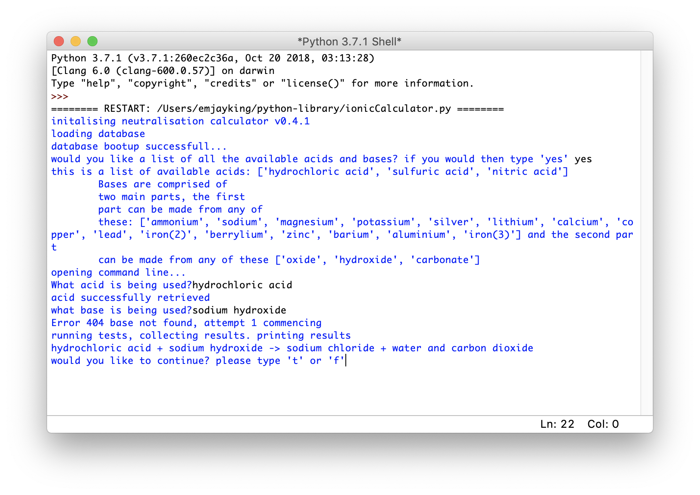

### [Home](../index.md)

# Disclaimer
If you were to download these files and try to run them, they would not work. So just take my word for it when I say they are awesome. To run them you must install the latest [python idle](https://www.python.org/downloads/) and then open the file using the IDLE application and run the code.
I do not recommend doing this, instead I will insert screen shots and describe what the code does.
You can ask the DIT teacher to run the files if you would proof that they work. You can also find the latest versions of all my python work on my [Python Repository on GitHub](https://github.com/emjayking/python-library).

## [Automatic Spirograph](https://github.com/emjayking/My-Portfolio/blob/master/python/autospiro.py)
This awesome little code creates a random spirograph. After a certain amount of time the spirograph will change to a new one. The colour of the line is random. This code was a pet project of mine, it is a modified version of someone else's work. I copied their calculations for the drawing of the graph but I customised the code to make it automatic and random. I also improved the stability of it so it no longer randomly crashes (like the original did.)
click on video to view on youtube (even if no image is present, just click the icon)

## [Ionic Calculator](https://github.com/emjayking/python-library/blob/master/ionicCalculator.py)
This code was born after I got very bored in science. I have made a code the calculates result of any given ionic equation when the user inputs an acid and a base. This only gives the word equation at the moment however, a balanced chemical version is on the way. The picture below is of a typical user input, and the result.  

## Future Content
I have made lots of other cool Python codes however I do not feel the need to share them here. Simply have a look at my my python Repository which was linked in the disclaimer. I may add more code in the future as I complete more interesting work. 
