### [Home](../index.md)

These are [metal earth models](http://www.fascinations.com/metalearth) that I have built over the years.
I feel this displays a talent and enthusiasm for modelling and tinkering. Also I have included a peice of digital artwork I did based on a blender tutorial. I am teaching myself to model in blender because I may want to pursue a career in digital art.

# Models

## Big Ben
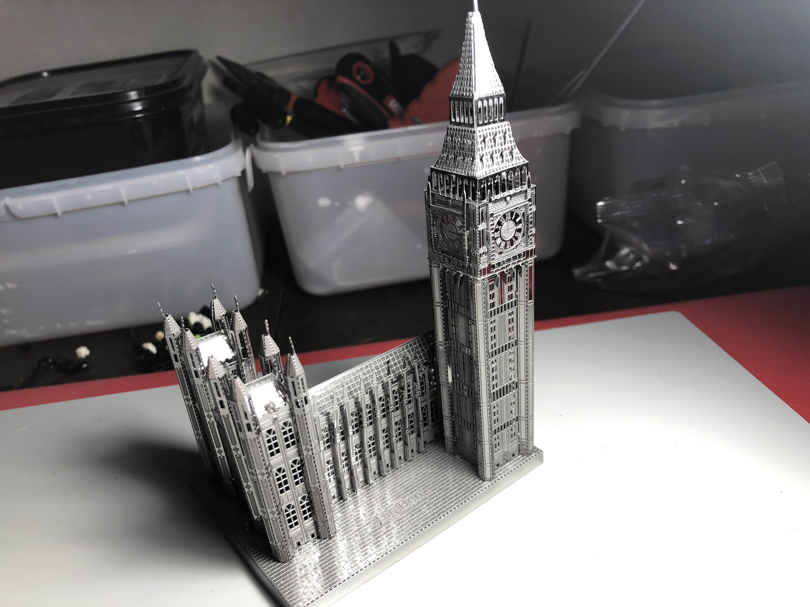

## Golden Gate Bridge
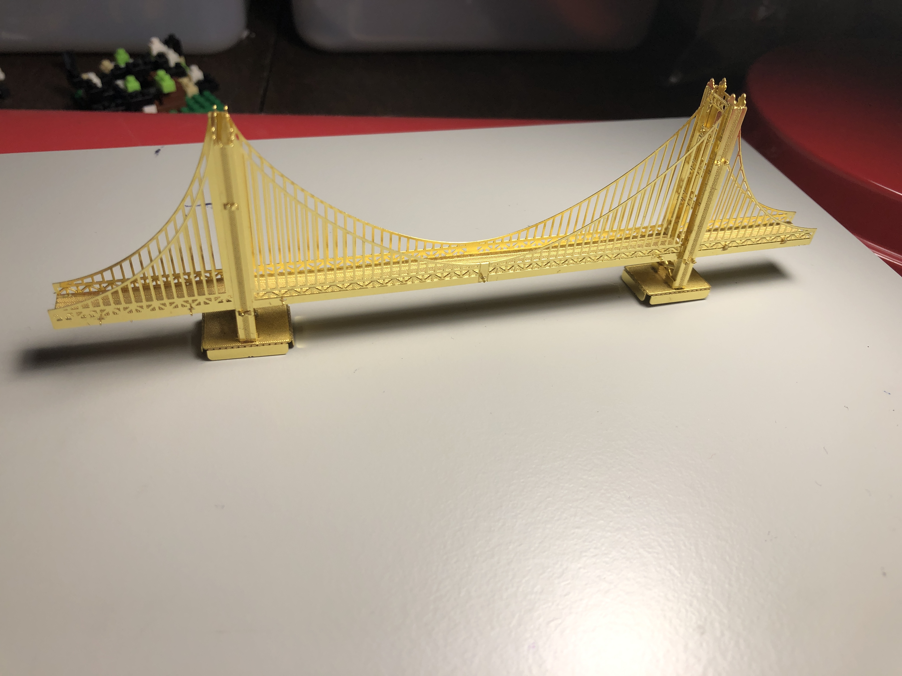

## San Francisco Cable Car
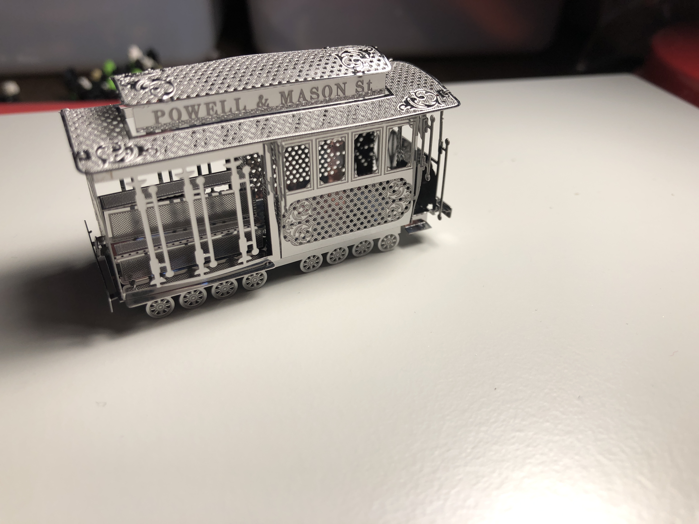

## neuschwanstein Castle
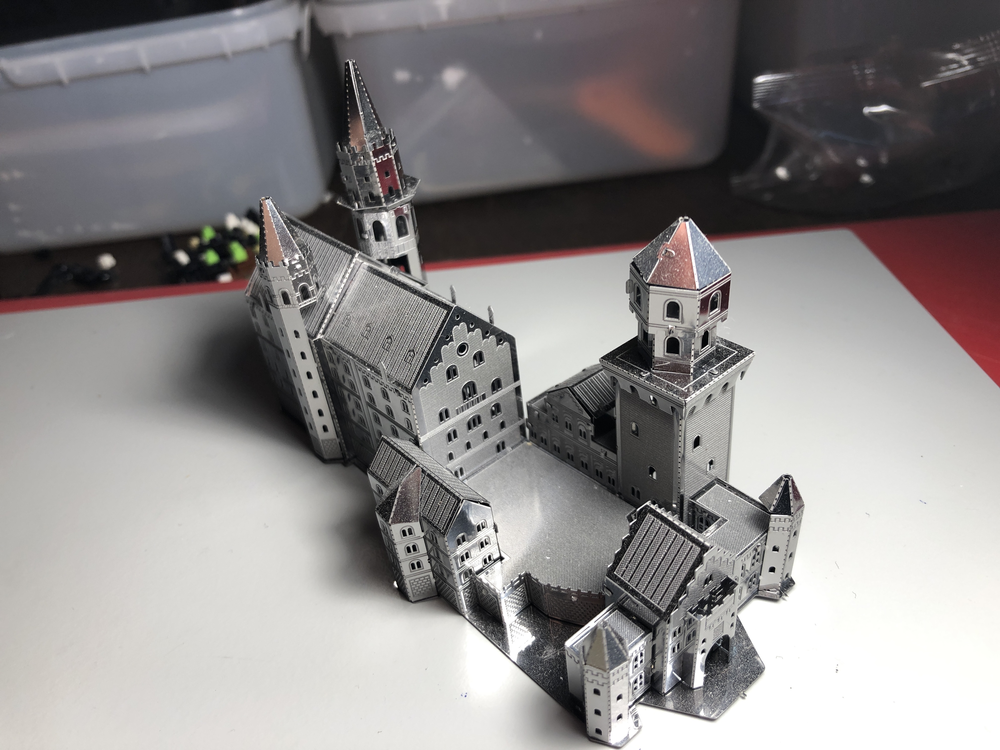

## Disney Land Ferris Wheel
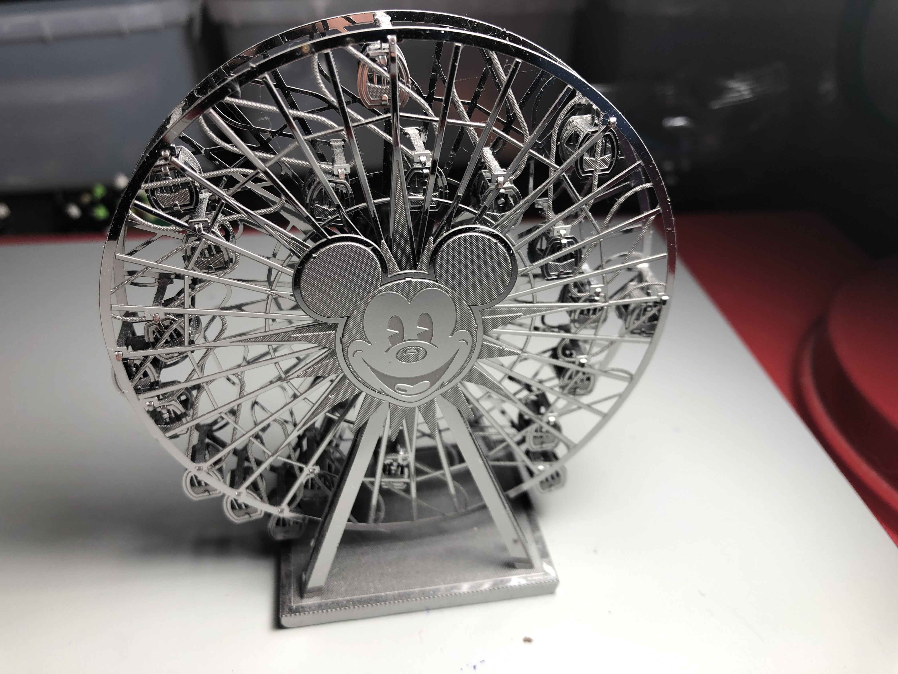

## Iron Man Helmet
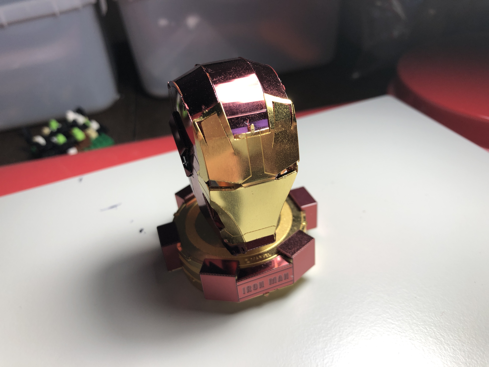

## Antique Film Projector
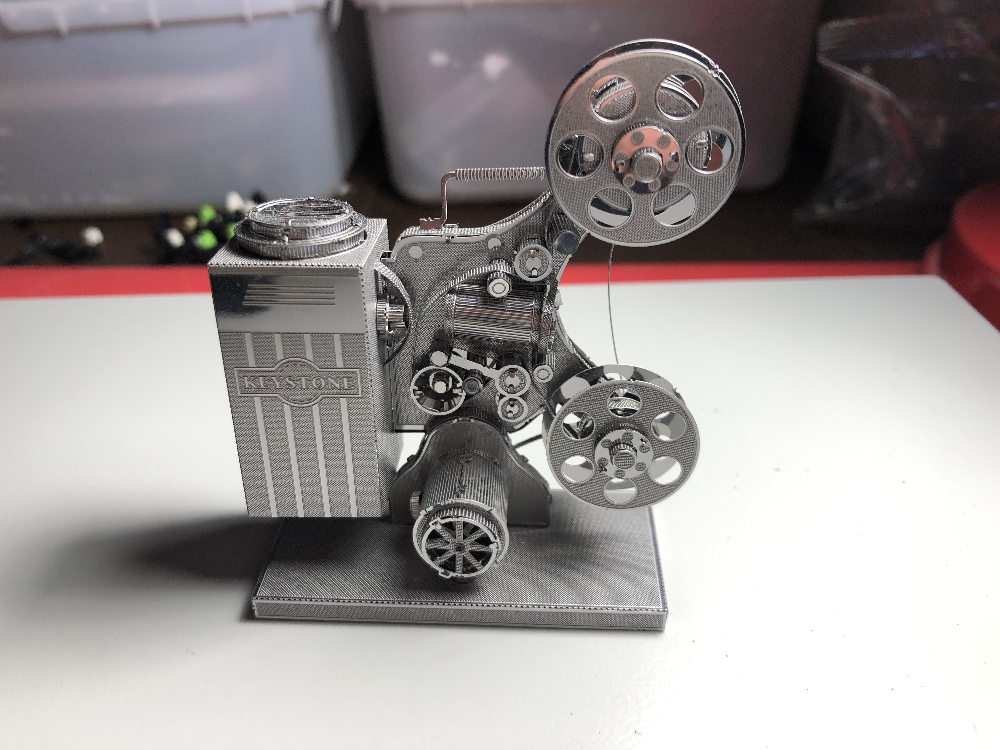

## Hubble Space Telescope
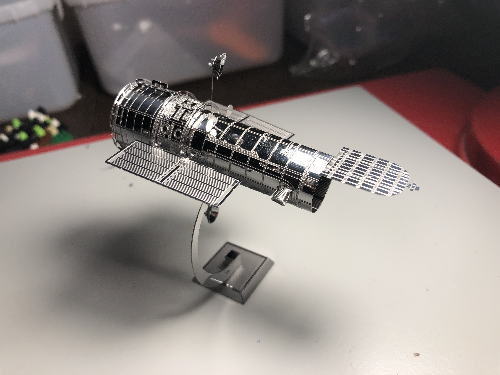

## Time And Relative Dimension In Space (TARDIS)
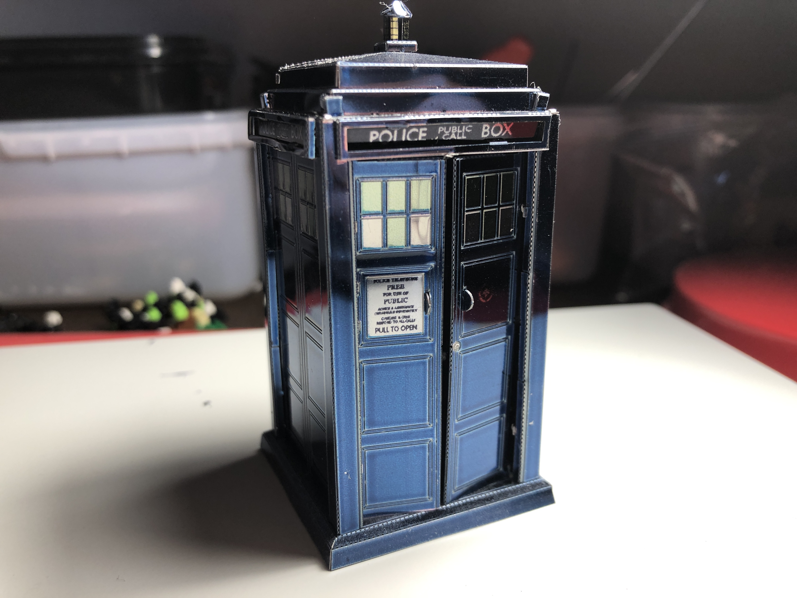

## Thor's Hammer
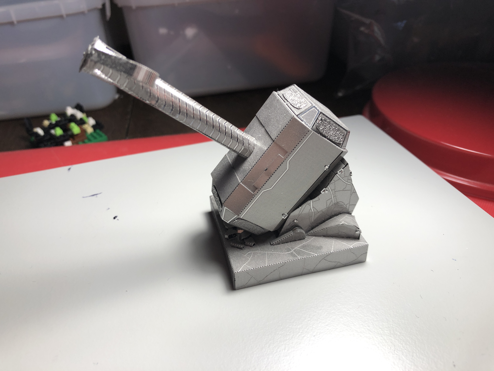

## Star Wars Rebel X-Wing
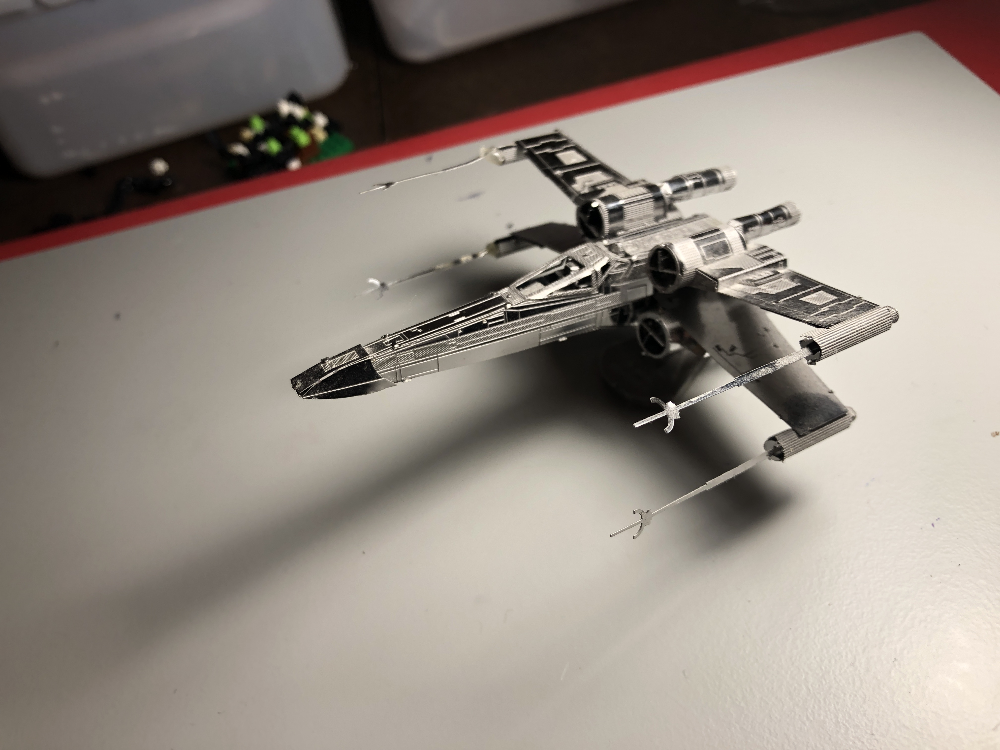

# Digital Art
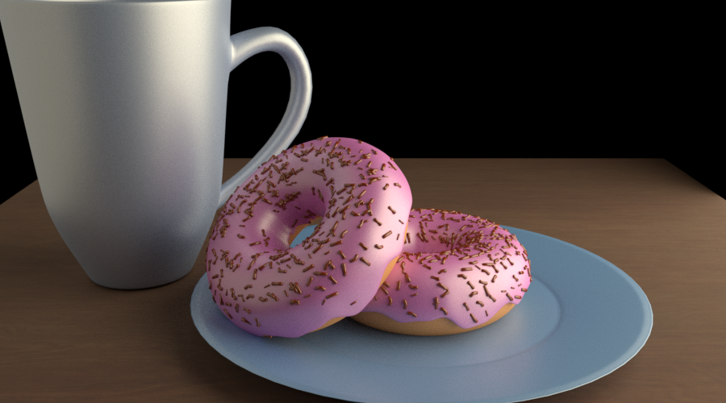
